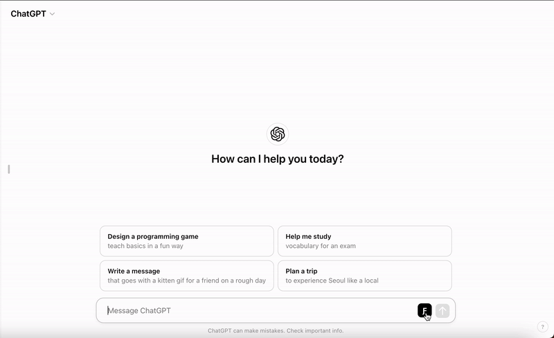

# Fabric Browser Extension

Integrates GPT prompts (patterns) sourced from [Fabric](https://github.com/danielmiessler/fabric) directly into the ChatGPT's web interface on Chrome.

It includes settings to choose b/w fabric patterns, disable/enable them per need, and to output the GPT response in a standard or markdown format.

This extension is a hobby project designed for experimental purposes. Please note that not all Fabric prompts may work as intended with ChatGPT.

## Installation

You can install the Fabric Browser Extension from the [Chrome Web Store](#) or manually load it as an unpacked extension:

1. Clone this repository or download and extract the ZIP file.
2. Open Google Chrome and navigate to `chrome://extensions/`.
3. Enable Developer Mode using the toggle switch in the top right corner.
4. Click on "Load unpacked" and select the directory where you cloned/downloaded the extension.
5. The extension should now be loaded and ready to use in Chrome on the [chatGPT's](https://chatgpt.com/) website.

## Usage

Once installed, the Fabric Browser Extension adds a button to the chat input in [chatGPT's](https://chatgpt.com/) web interface.

1. Enable a fabric pattern by clicking on the fabric button to access settings and selecting a pattern. ex: `extract_wisdom`. The settings you choose are persisted across sessions.
2. Now any message you send to chatGPT will be augmented by the pattern you selected earlier. You can turn off prompt augmentation by disabling the patterns option in settings.

## Limitations

ATM, the extension only supports ChatGPT and Chrome Browser.
